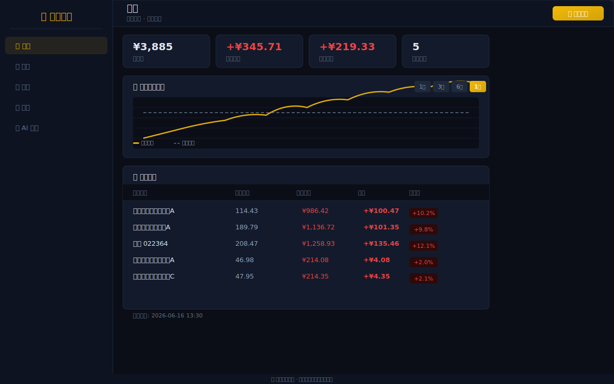

<p align="center">
  
  
  
  
</p>

<h1 align="center">Fund Scope · 基金范围</h1>

<p align="center">
  个人基金量化分析平台 — 管理持仓、多因子评分、智能定投、AI 问答<br>
  数据驱动决策，让每一笔投资都有据可依。
</p>

<p align="center">
  <a href="#features">功能</a> ·
  <a href="#screenshots">截图</a> ·
  <a href="#quick-start">快速开始</a> ·
  <a href="#configuration">配置</a> ·
  <a href="#development">开发</a> ·
  <a href="#deployment">部署</a>
</p>

## Screenshots

<p align="center">
  
  <br>
  <em>概览页面 — 资产统计、组合历史走势、持仓明细</em>
</p>

---

## Features

<table>
  <tr>
    <td width="50%">
      <h3>📊 行情看板</h3>
      <ul>
        <li>总资产、累计收益、日收益一目了然</li>
        <li>组合历史走势曲线 + 盈亏分布 Chart.js 可视化</li>
        <li>昨日收益对比，追踪每日波动</li>
      </ul>
    </td>
    <td width="50%">
      <h3>📋 智能持仓管理</h3>
      <ul>
        <li>添加/编辑/删除基金持仓</li>
        <li>自动同步最新净值和收益</li>
        <li>组合穿透分析，了解底层资产分布</li>
      </ul>
    </td>
  </tr>
  <tr>
    <td>
      <h3>🎯 多因子评分</h3>
      <ul>
        <li>基于多维度指标（收益率、波动率、夏普比率等）自动评分</li>
        <li>五星评级 + 买卖持有信号</li>
        <li>辅助基金筛选，快速定位优质基金</li>
      </ul>
    </td>
    <td>
      <h3>🤖 AI 问答</h3>
      <ul>
        <li>接入 DeepSeek API，智能分析基金</li>
        <li>预计算专业指标（年化收益率、最大回撤、Alpha/Beta等）</li>
        <li>结构化的分析框架，辅助投资决策</li>
      </ul>
    </td>
  </tr>
  <tr>
    <td>
      <h3>📅 智能定投规划</h3>
      <ul>
        <li>按日/周/月频率自动计算定投期数</li>
        <li>基于实际净值交易日精准计数</li>
        <li>已投金额自动累加，支持终止/恢复</li>
      </ul>
    </td>
    <td>
      <h3>🔍 基金筛选</h3>
      <ul>
        <li>按类型、主题、收益率等多条件组合筛选</li>
        <li>中国公募基金全市场覆盖</li>
      </ul>
    </td>
  </tr>
  <tr>
    <td>
      <h3>📧 每日收益报告</h3>
      <ul>
        <li>定时邮件推送每日持仓收益</li>
        <li>支持自定义推送时间和邮箱</li>
      </ul>
    </td>
    <td>
      <h3>🔐 用户系统</h3>
      <ul>
        <li>JWT 认证，注册/登录/验证码</li>
        <li>邮箱验证，保障账户安全</li>
      </ul>
    </td>
  </tr>
  <tr>
    <td>
      <h3>⭐ 自选列表</h3>
      <ul>
        <li>先跟踪再买入，管理感兴趣基金</li>
        <li>一键从筛选/分析页加入自选</li>
      </ul>
    </td>
    <td>
      <h3>📱 PWA 支持</h3>
      <ul>
        <li>添加到主屏幕，像原生APP一样使用</li>
        <li>Service Worker 离线缓存</li>
      </ul>
    </td>
  </tr>
</table>

## Tech Stack

| Layer | Technology |
|-------|-----------|
| **Backend** | Python 3.11+, Flask, PyJWT |
| **Frontend** | Vanilla JS SPA, Chart.js |
| **Data** | SQLite, akshare (中国公募基金数据) |
| **AI** | DeepSeek API |
| **Email** | SMTP (SendGrid / QQ邮箱等) |
| **Deploy** | Docker Compose, Nginx |

## Quick Start

### Prerequisites

- Docker & Docker Compose（[安装指南](https://docs.docker.com/compose/install/)）

### 1. 克隆仓库

```bash
git clone https://github.com/Shihengtao2324/fund-scope.git
cd fund-scope
```

### 2. 配置环境变量（必须）

项目通过 `.env` 文件读取所有敏感配置。**你需要复制模板并填入自己的密钥：**

```bash
cp .env.example .env
```

然后**打开 `.env` 文件**，至少修改以下两项：

| 变量 | 必须 | 说明 |
|------|------|------|
| `JWT_SECRET` | **是** | 密钥，用于加密登录令牌。运行 `python3 -c "import secrets; print(secrets.token_hex(32))"` 生成 |
| `DEEPSEEK_API_KEY` | 否 | DeepSeek API 密钥，[点此申请](https://platform.deepseek.com/)（AI 问答需要） |

> ⚠️ **注意**：`.env` 文件包含你的敏感信息，已被 `.gitignore` 排除，**不会**提交到 Git。

### 3. 启动

```bash
docker compose up -d --build
```

访问 http://localhost:5000

> 首次启动会自动创建数据库表，无需手动初始化。

---

### 你需要修改的文件

首次使用只需关注以下 **2 个文件**：

#### 📄 `.env` — 配置你自己的密钥
所有密码、API Key 都写在这里。模板 `.env.example` 已注释了每个字段的用途。

| 配置项 | 怎么填 |
|--------|--------|
| `JWT_SECRET` | 运行 `python3 -c "import secrets; print(secrets.token_hex(32))"`，粘贴结果 |
| `SMTP_USER` / `SMTP_PASS` | 你的邮箱和 SMTP 授权码（非登录密码） |
| `DEEPSEEK_API_KEY` | DeepSeek 平台的 API Key |

#### 🐳 `docker-compose.yml` — 按需修改
- **国内用户**：Dockerfile 已配置 USTC / 清华镜像加速，开箱即用
- **海外用户**：如果构建慢，可以删除 Dockerfile 中 `sed -i` 和 `pip install -i` 的国内镜像源

---

更多功能截图可以在 [docs/screenshots/](docs/screenshots/) 查看。

## Configuration

所有配置通过环境变量注入，详见 [`.env.example`](.env.example)。

| 变量 | 必填 | 说明 |
|------|------|------|
| `JWT_SECRET` | ✅ | JWT 签名密钥 |
| `DEEPSEEK_API_KEY` | ❌ | DeepSeek API Key（AI 问答功能需要） |
| `SMTP_SERVER` | ❌ | SMTP 服务器地址，默认 `smtp.qq.com` |
| `SMTP_PORT` | ❌ | SMTP 端口，默认 `465` |
| `SMTP_USER` | ❌ | SMTP 用户名 |
| `SMTP_PASS` | ❌ | SMTP 密码/授权码 |
| `DAILY_REPORT_EMAIL` | ❌ | 每日报告接收邮箱 |
| `DAILY_REPORT_TIME` | ❌ | 每日报告发送时间，默认 `20:00` |

## Development

本地开发（跳过 JWT 认证，免登录）：

```bash
cd backend
pip install -r requirements.txt
FLASK_DEBUG=1 SKIP_AUTH=1 python app.py
```

访问 http://localhost:5000

### Project Structure

```
fund-scope/
├── backend/
│   ├── app.py              # Flask 主入口（~60 routes）
│   ├── auth.py             # JWT 认证、注册、验证码
│   ├── config.py           # 配置读取（环境变量）
│   ├── database.py         # SQLite ORM
│   ├── email_sender.py     # 邮件发送
│   ├── fund_data.py        # akshare 数据获取 & 缓存
│   └── fund_analysis.py    # 多因子评分分析
├── frontend/
│   ├── index.html          # SPA 入口
│   ├── css/                # 样式
│   └── js/app.js           # 页面路由 & 交互逻辑
├── docs/
│   └── screenshots/        # 界面截图
├── Dockerfile
├── docker-compose.yml
├── .env.example
└── README.md
```

## Deployment

### Docker 部署（推荐）

```bash
docker compose up -d --build
```

建议配合 Nginx 反向代理 + HTTPS（如使用 Let's Encrypt）。

### 自动部署

项目内置了 Gitee/GitHub Webhook 自动部署支持：

1. 在 `.env` 中配置 `WEBHOOK_SECRET`
2. 在代码托管平台配置 Webhook POST 到 `https://your-domain/api/deploy`
3. 宿主机 cron 每分钟检测 `.deploy-trigger` 文件，自动执行 `docker compose up -d --build`

## Data Source

所有基金数据通过 [akshare](https://github.com/akfamily/akshare) 从中国公募基金公开市场获取，数据缓存 4 小时以减少请求频率。

## License

[MIT](LICENSE)

---

<p align="center">
  Built with ❤️ for personal fund analytics
</p>
